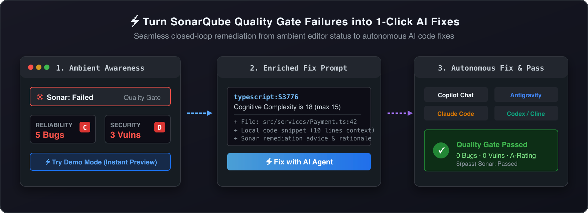
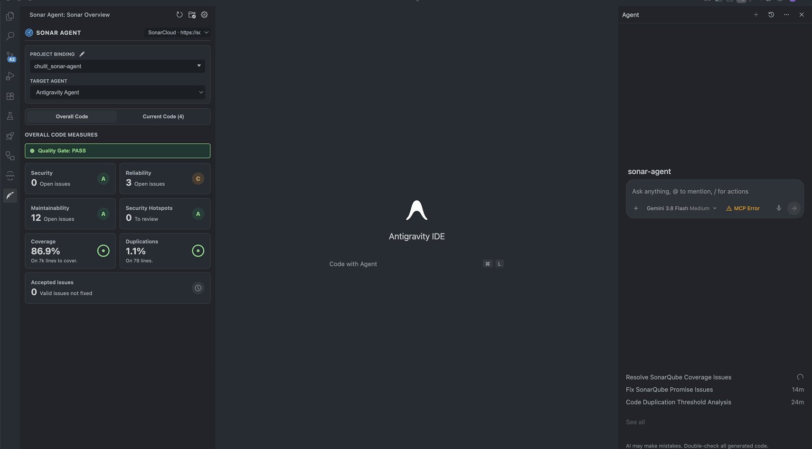

<p align="center">
  
</p>

<h1 align="center">Sonar Agent</h1>

<p align="center">
  <strong>Turn SonarQube Quality Gate Failures into Instant 1-Click AI Fixes</strong><br>
  <em>Connect SonarQube & SonarCloud directly to GitHub Copilot, Claude Code, Google Antigravity, Roo Code, Cline, and OpenAI Codex</em>
</p>

<p align="center">
  <a href="https://marketplace.visualstudio.com/items?itemName=chulit.sonar-agent"></a>
  <a href="https://open-vsx.org/extension/chulit/sonar-agent"></a>
  
  
</p>

<p align="center">
  
  
  
  
  
  
</p>

<p align="center">
  
</p>

---

A modern VS Code extension connecting your **SonarQube** and **SonarCloud** projects directly into the editor. Monitor real-time **Overall Code quality metrics**, inspect ratings (A–E), triage issues with rich filters, and use the **"Send to Agent"** workflow to automatically generate enriched AI fix prompts for **GitHub Copilot**, **Google Antigravity**, **Claude Code**, **Roo Code**, **Continue**, **Cline**, **OpenAI Codex**, or your clipboard.

A powerful companion to SonarLint that bridges clean code analysis with AI-assisted remediations.

<p align="center">
  
</p>

---

## Key Features

- **⚡ Instant Demo Mode (Zero Setup Playground)**:
  - Don't have a SonarQube server or user token ready yet? Try Sonar Agent immediately with zero configuration!
  - Click **"⚡ Try Demo Mode (Instant Preview)"** in the onboarding view to experience realistic Quality Gate statuses, metric drilldowns, and 1-Click AI Fix prompt dispatching on realistic sample code.
- **🛡️ Ambient Status Bar Item**:
  - Live Quality Gate indicator (`$(pass) Sonar: Passed`, `$(error) Sonar: Failed`, or `$(beaker) Sonar: Demo`) in the VS Code status bar.
  - Hovering displays a rich Markdown tooltip summarizing project key and full metric breakdown (Bugs, Vulnerabilities, Hotspots, Code Smells, Coverage, Duplications).
  - Clicking focuses the Sonar Overview sidebar view immediately.
- **Overall Code Dashboard**: Visualizes measures for Bugs, Vulnerabilities, Security Hotspots, Code Smells, Coverage, and Duplications mirroring SonarQube's web UI.
- **Rating Badges**: Clear A–E letter grade ratings with standard Sonar color coding.
- **Multiple Connection Profiles**: Seamlessly switch between different SonarQube / SonarCloud instances (e.g. production, staging, localhost) directly from the sidebar switcher.
- **Rich Issue Triage & Filtering**: Filter issues dynamically by Severity, Type, Author, File, Rule, and toggle test files exclusion.
- **Direct Drilldown & Jump to Code**: Click on any metric card to inspect related issues or security hotspots, and jump to the affected file and line inside VS Code with a single click.
- **Send to Agent (AI-Assisted Fixing)**:
  - Enriches issues with SonarQube rule documentation and local surrounding code (10 lines of context).
  - Supports targeting **GitHub Copilot**, **Google Antigravity**, **Claude Code**, **Roo Code**, **Continue**, **Cline**, **OpenAI Codex**, or **Clipboard**.
  - Single issue fix and **batch multi-selection** with grouped per-file prompts.
  - Specialized actions for coverage gaps (_Generate Tests_) and duplicated code blocks (_Refactor_).
- **Editor Quick Fixes (Code Actions)**: Trigger `⚡ Send to AI Agent` directly from the editor lightbulb (`Cmd+.` / `Ctrl+.`) on any SonarLint or SonarQube diagnostic.
- **Responsive Layout**: Designed for the sidebar using modern CSS Container Queries (`@container`) with adaptive 1-column (<340px) and 2-column (≥340px) layouts.
- **Strict Security & Zero Token Leakage**:
  - Tokens are stored exclusively in the OS Keychain via `vscode.SecretStorage`.
  - Tokens are never exposed in `settings.json`, Webview `postMessage`, AI prompts, or git files.
  - Warns if plaintext credentials are found in `sonar-project.properties`.

---

## Getting Started

### Quick Start with Demo Mode

1. Install the extension and open the **Sonar Agent** sidebar icon in the Activity Bar.
2. Click **"⚡ Try Demo Mode (Instant Preview)"**.
3. Explore the dashboard, click on **Bugs** or **Security**, and click **"Fix with Agent"** on any sample issue to test prompt generation!
4. When you're ready to connect to your live server, click **"Exit Demo Mode"** in the top banner.

### Connecting to Live SonarQube or SonarCloud

#### 1. Connection Profiles

1. Click the **Sonar Agent** icon in the Activity Bar to open the sidebar.
2. If no profiles exist, click **Add Profile** to create your first connection:
   - **Profile Name**: e.g. `SonarCloud`, `Company SonarQube`, or `Localhost`
   - **Server URL**: e.g. `https://sonarcloud.io` or `https://sonar.example.com`
   - **User Token**: Generated from SonarQube (_User > My Account > Security > Generate Tokens_)
3. Use the **Profile Switcher** dropdown at any time to switch active servers or manage profiles (Add, Edit, Delete).

#### 2. Project Selection

- **Automatic Detection**: The extension automatically detects `sonar.projectKey` if a `sonar-project.properties` file exists in the workspace.
- **Server Search**: Alternatively, click the project selector in the sidebar or run `Sonar Agent: Select Sonar Project` to search and pick from your server's projects.

#### 3. AI Agent Dispatch

- Select your default target agent from the dropdown at the bottom of the sidebar (**GitHub Copilot**, **Google Antigravity**, **Claude Code**, **Roo Code**, **Continue**, **Cline**, **Codex**, or **Clipboard**).
- Click **Fix with Agent** on any issue or select multiple issues and click **Send Selected to Agent**.

---

## Commands

Access these commands via the Command Palette (`Cmd+Shift+P` / `Ctrl+Shift+P`):

| Command                                         | Identifier                   | Description                                                  |
| ----------------------------------------------- | ---------------------------- | ------------------------------------------------------------ |
| **Sonar Agent: Refresh**                        | `sonarAgent.refresh`         | Re-fetches latest measures and issues from SonarQube         |
| **Sonar Agent: Select Sonar Project**           | `sonarAgent.selectProject`   | Opens a QuickPick list of projects from the connected server |
| **Sonar Agent: Configure Connection**           | `sonarAgent.configure`       | Opens interactive connection configuration and settings menu |
| **Sonar Agent: Manage Connection Profiles**     | `sonarAgent.profile.manage`  | Opens profile management to add, edit, or delete profiles    |
| **Sonar Agent: Disconnect & Reset Credentials** | `sonarAgent.resetConnection` | Disconnects and removes stored SonarQube credentials         |
| **Sonar Agent: Fix Sonar Issue with AI Agent**  | `sonarAgent.fixWithAgent`    | Triggers AI fix dispatch for the active diagnostic           |
| **Sonar Agent: Show Logs**                      | `sonarAgent.showLogs`        | Opens the Sonar Agent output log channel                     |

---

## Development & Testing

```bash
# Typecheck
npm run check

# Run unit tests
npm test

# Build bundle
npm run build

# Watch mode
npm run watch

# Package .vsix
npx @vscode/vsce package --no-git-tag-version --allow-missing-repository
```

---

## Architecture

- [`src/modules/ProjectDetector.ts`](file:///Users/kholid/Documents/Project/JS/sonar-agent/src/modules/ProjectDetector.ts): Resolves connection profiles, workspace properties, and secure token storage.
- [`src/modules/SonarClient.ts`](file:///Users/kholid/Documents/Project/JS/sonar-agent/src/modules/SonarClient.ts): SonarQube REST API client with in-memory caching and error mapping.
- [`src/modules/DemoData.ts`](file:///Users/kholid/Documents/Project/JS/sonar-agent/src/modules/DemoData.ts): Encapsulates realistic sample metrics, failing Quality Gate conditions, and mock issues.
- [`src/modules/SonarStatusBar.ts`](file:///Users/kholid/Documents/Project/JS/sonar-agent/src/modules/SonarStatusBar.ts): Encapsulates VS Code Status Bar item lifecycle, ambient Quality Gate icons, and rich Markdown tooltips.
- [`src/modules/FileNavigator.ts`](file:///Users/kholid/Documents/Project/JS/sonar-agent/src/modules/FileNavigator.ts): Workspace file resolution (with monorepo fallback) and editor line jumping.
- [`src/modules/AgentDispatcher.ts`](file:///Users/kholid/Documents/Project/JS/sonar-agent/src/modules/AgentDispatcher.ts): Assembles enriched prompts and dispatches to Copilot, Antigravity, Claude Code, Roo Code, Continue, Cline, Codex, or Clipboard.
- [`src/modules/SonarCodeActionProvider.ts`](file:///Users/kholid/Documents/Project/JS/sonar-agent/src/modules/SonarCodeActionProvider.ts): Editor Quick Fix code action provider integrating Sonar diagnostics with AI agent fix prompts.
- [`src/modules/ConnectionProfileWizard.ts`](file:///Users/kholid/Documents/Project/JS/sonar-agent/src/modules/ConnectionProfileWizard.ts): Connection profile management and project selection prompt wizard.
- [`src/modules/SonarOverviewViewProvider.ts`](file:///Users/kholid/Documents/Project/JS/sonar-agent/src/modules/SonarOverviewViewProvider.ts): Sidebar Webview view provider with CSS container queries and message passing.

---

## License

[MIT](LICENSE.md)
